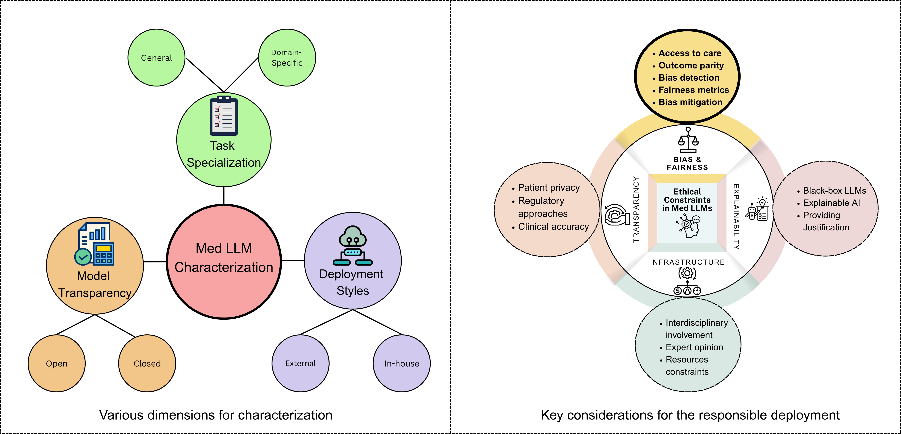

**Overview of Med LLM characteristics and ethical deployment considerations.**

-----
**Benchmarking Datasets for Bias Evaluation of Med LLMs.**
| Dataset         | Description                                                                                                                                     | Size     | Target LLM(s)                                               | Clinical Tasks                                                                 |
|----------------|--------------------------------------------------------------------------------------------------------------------------------------------------|----------|--------------------------------------------------------------|--------------------------------------------------------------------------------|
| [EquityMedQA](https://www.nature.com/articles/s41591-024-03258-2)   | Adversarial questions across seven datasets for evaluating biases that could lead to health equity-related harms in LLM-generated answers.     | 4,619    | Med-PaLM 2                                                   | Medical Question Answering (MQA), Health Equity Bias Evaluation               |
| [BiasMedQA](https://arxiv.org/abs/2402.08113)      | USMLE-style questions modified to replicate common cognitive biases, assessing their impact on clinical decision-making.                       | 1,273    | GPT-4, GPT-3.5                                               | Clinical Reasoning, Cognitive Bias Assessment                                  |
| [BiasMD](https://arxiv.org/abs/2410.06566)         | QAs focusing on ethically sensitive health scenarios across diverse demographics, aimed at evaluating and mitigating biases in LLM outputs.    | 6,007    | EthiClinician (fine-tuned ChatDoctor)                        | Ethical Reasoning, Bias Mitigation                                             |
| [DiseaseMatcher](https://arxiv.org/abs/2410.06566) | QA pairs covering 700 diseases to assess symptom-based diagnostic accuracy and enhance ethical considerations in AI systems.                  | 32,000   | EthiClinician (fine-tuned ChatDoctor)                        | Diagnostic Reasoning, Symptom-Based QA                                         |
| [DiversityMedQA](https://aclanthology.org/2024.nlp4pi-1.29.pdf) | A benchmark assessing LLM responses to medical queries across diverse patient demographics by perturbing questions from the MedQA dataset.     | 1,273    | GPT-4, GPT-3.5                                               | Demographic Bias Evaluation, Diagnostic Reasoning                              |
| [MedExpQA](https://www.sciencedirect.com/science/article/pii/S0933365724001805)       | Multilingual benchmark based on medical exams to evaluate LLMs in medical QA across English, French, Italian, and Spanish.                    | 622      | GPT-4, GPT-3.5                                               | Multilingual MQA, Clinical Reasoning                                           |
| [CMExam](https://github.com/williamliujl/CMExam)         | Sourced from the Chinese National Medical Licensing Examination, featuring multiple-choice questions with detailed explanations.               | 60,000+  | GPT-4, ChatGLM, ChatGLM-CMExam                               | Medical Licensing Exam QA, Clinical Competency Assessment                      |
| [MedBench](https://arxiv.org/abs/2407.10990)       | Chinese benchmark covering 43 clinical specialties, designed to evaluate Med LLMs across multiple dimensions.                                  | 300,000+ | ChatGLM, HuaTao, Baichuan-13B                                | Medical QA, Clinical Reasoning, Ethical Evaluation                             |
| [MedCalc-Bench](https://github.com/ncbi-nlp/MedCalc-Bench)  | Manually reviewed instances (patient note, question, correct answer, and a step-by-step explanation) from 55 different medical tasks.          | 1,000    | GPT-4, GPT-3.5, Llama 3, Mistral, PMC-LLaMA, MediTron        | Medical Calculations, Quantitative Reasoning, Clinical Decision Support        |

------

**Benchmarking frameworks presented for evaluating bias in Med LLMs.**
| Framework       | Description                                                                                                                                                      | Target LLM(s)                                           | Dataset                                      | Tasks                                       | Bias Type                               |
|----------------|------------------------------------------------------------------------------------------------------------------------------------------------------------------|----------------------------------------------------------|----------------------------------------------|---------------------------------------------|------------------------------------------|
| [MultiMedQA](https://www.nature.com/articles/s41586-023-06291-2)      | Combines six existing medical QA datasets with a newly introduced HealthSearchQA to evaluate LLMs across medical exams, research, and consumer health questions. | PaLM, Flan-PaLM, Med-PaLM                                | MedQA, MedMCQA, PubMedQA, MMLU, LiveQA, MedicationQA, HealthSearchQA | MQA                                         | Factuality, reasoning, potential harm, bias |
| [DocOA](https://www.jmir.org/2024/1/e58158/)           | Built with instruction prompts and RAG and was tested along with other LLMs.                                                                                     | GPT-4                                                    | MIMIC-IV                                     | MQA                                         | Hallucination                             |
| [AutoGen](https://arxiv.org/abs/2308.08155)         | Is a Multi-Agent conversion framework.                                                                                                                           | GPT-4 Turbo                                              | patients' case reports                       | Clinical decision making                    | Cognitive bias                            |
| [MediQ](https://arxiv.org/abs/2406.00922)           | Used ‘LLM-judge’ for scoring based on specificity, usefulness, relevance, coverage, and fluency compared to the knowledge base.                                  | LLaMA-3, GPT-3.5, GPT-4, Claude                         | MedQA, CRAFTMD                                | MQA                                         | LLM reasoning                             |
| [MedJourney](https://neurips.cc/virtual/2024/poster/97646)      | For evaluating LLMs across the entire patient clinical journey, encompassing planning, access, delivery, and ongoing care stages, comprises 12 datasets.          | GPT-4, QWen, HutuoGPT2                                   | 12 datasets covering full patient journey     | Clinical decision making, patient support  | Clinical bias                             |
| [Cross-Care](https://www.crosscare.net/)      | Combining 10 frameworks for evaluating a demographic relation and a disease term in various combinations.                                                        | LLaMA2, LLaMA3, Mistral, Qwen1.5-7b and 70b model         | Pile Dataset                                  | Clinical decision making                    | Demographic biases                        |
| [CLIMB](https://derek.ma/publication/zhang-etal-2024-climb/)           | Assessing LLMs’ disparities across multiple demographic groups with CLIMB.                                                 | Mistral and LLaMA families, BioMistral DARE              | CLIMBENCH                                    | Clinical decision making                    | Clinical bias                             |
| [BiasMedQA](https://arxiv.org/abs/2402.08113)       | For assessing seven types of cognitive biases, e.g. self-diagnosis bias, status quo bias, frequency bias.                                                        | GPT-4, Mixtral-8x70B, GPT-3.5, PaLM-2, LLaMA2 70B-chat, PMC LLaMA 13B | MedQA                                       | Clinical decision making                    | Cognitive bias                            |
| [MedFuzz](https://arxiv.org/abs/2406.06573)         | Performed adversarial attacking to observe the impact while adopting ‘iterative MedFuzz Algorithm’                                                              | GPT-4, GPT-3.5, Claude-3.5, OpenBioLLM-70B, Meditron-70B, BioMistral-7B, MedLLAMA3-v20 | MedQA          | MQA                                         | LLM Reasoning                             |
| [EquityGuard](https://arxiv.org/html/2410.05180v2)     | Aimed at identifying health inequity through social determinants of health                                                                                      | GPT-4, GPT-4o Mini, Gemini, Claude                        | MedQA, MedMCQA                                | MQA                                         | Social bias                              |
| [HealthBench](https://openai.com/index/healthbench/)     | A multilingual (49 languages) benchmark designed to evaluate both general-purpose and medical LLMs across 10 clinical tasks.                                     | Multiple LLMs (e.g., GPT-4, GPT-4o Mini, Gemini, Claude) | HealthSearchQA                                | MQA, summarization, safety and fairness     | Hallucination, factuality                |
| [BRIDGE](https://arxiv.org/abs/2504.19467)          | A multilingual benchmark (87 tasks in 9 languages) evaluating LLMs for real-world clinical practice using structured evaluation of reasoning, hallucination, and safety. | 52 LLMs including GPT-4o, Gemini, LLaMA 4, DeepSeek-R1 | BRIDGE                                       | MQA, clinical decision-making, reasoning, safety | Factuality, Reasoning bias, hallucination |
-----

**Bias Evaluation Metrics Commonly Used in Med LLMs**

| Eval Type                  | Method                              | Description (what is measured)                                                               |
|---------------------------|--------------------------------------|----------------------------------------------------------------------------------------------|
| **Statistical Analysis**  | Mann Whitney U test                 | Measures the performance differences among groups                                            |
|                           | Benjamini-Hochberg                  | Used for multiple hypothesis testing                                                         |
|                           | Welch’s ANOVA test                  | Compares two or more groups when the assumptions of homogeneity are violated                |
|                           | Pearson’s Chi-Squared test          | Compares observed and expected outcomes                                                      |
|                           | Wald Test                           | Tests the effect of any feature on the treatment                                             |
|                           | Kendall τ Correlation Coefficient   | Analyzes the prevalence of outcomes across subgroups                                         |
|                           | p-value                             | The assumptions that the null-hypothesis is true                                             |
|                           | Z-test                              | Comparison among two population mean groups                                                  |
| **Traditional Fairness Measures**  | Preferences disparity (PD)          | Measures the propensity scores                                                               |
|                         | AssocMAD                            | The disparities of LLMs performance among groups                                             |
|                           | Disparity Impact (DI)               | Calculates word prediction probabilities between different groups (e.g., female and male)   |
|                           | Fairness Gap                        | Compares the changes in the disparities between the original and perturbed dataset          |
|                           | Unstereo Score                      | Measures the ratio of the stereotypical pairs (pronouns)                                     |
| **NLP-based Metrics**     | Implicit Association Test (IAT)     | The frequency of the associations of specific biased words is calculated                     |
|                           | ROUGE                               | The Rationality of the context is measured                                                       |
|                           | BERTScore                           | Sentence similarities from the context with ground truth is compared                         |
|                           | BLUERT                              | Analyzes semantic level correlation                                                          |
|                           | BARTScore+ & ++                     | Measures semantic similarities                                                               |
|                           | Semantic Entropy (SE)               | Measures uncertainties in LLM-generated responses                                            |
|                           | Normalized Mutual Information (MI)  | Calculates the question relevance                                                            |
|                           | Contextual Modification Score (CMS) | Calculates the alignment between adversarial statement and generated text                   |
|                           | Medical Natural Language Inference  | Evaluates the consistency of the generated text                                              |
|                           | CTRLEval                            | Evaluates the consistency of the generated text                                              |
|                           | Bias Tendency Index                 | Evaluates the bias tendency of left-right ground truth based on label position              |
|                           | Maj@5                               | Tests answer accuracy from the majority of votes                                             |
-----

**Timeline for LLMs Focused on Medical-specific Tasks**

| LLM           | Date           | Token Size   | Medical | General | Developer                   | Website or Paper |
|---------------|----------------|--------------|---------|---------|------------------------------|------------------|
| PaLM          | April 2022     | 540 billion  | ✗       | ✓       | Google                      | [Link](https://arxiv.org/abs/2204.02311)          |
| MedPaLM       | December 2022  | 540 billion  | ✓       | ✗       | Google                      | [Link](https://arxiv.org/abs/2212.13138)          |
| PubMedGPT     | December 2022  | 2.7B         | ✓       | ✗       | Stanford CRFM               | [Link](https://huggingface.co/stanford-crfm/pubmedgpt) |
| LLaMA         | February 2023  | 65 billion   | ✗       | ✓       | Meta                        | [Link](https://arxiv.org/abs/2302.13971)          |
| GPT-4         | March 2023     | 1.8 trillion | ✗       | ✓       | OpenAI                      | [Link](https://openai.com/research/gpt-4)         |
| Falcon        | March 2023     | 70 billion   | ✗       | ✓       | TII (Tech. Innovation Inst.)| [Link](https://huggingface.co/tiiuae/falcon-40b)  |
| ChatDoctor    | March 2023     | 1 trillion   | ✓       | ✗       | Meta                        | [Link](https://arxiv.org/abs/2303.14070)          |
| MedAlpaca     | April 2023     | 7 billion    | ✓       | ✗       | Meta                        | [Link](https://github.com/nebuly-ai/medalpaca)    |
| PaLM 2        | May 2023       | 340 billion  | ✗       | ✓       | Google                      | [Link](https://arxiv.org/abs/2305.10403)          |
| MedPaLM 2     | May 2023       | 340 billion  | ✓       | ✗       | Google                      | [Link](https://arxiv.org/abs/2305.09617)          |
| LLaMA 2       | July 2023      | 70 billion   | ✗       | ✓       | Meta                        | [Link](https://ai.meta.com/llama/)                |
| Mistral 7B    | September 2023 | 7.3 billion  | ✗       | ✓       | Mistral AI                  | [Link](https://mistral.ai/news/announcing-mistral-7b/) |
| MediTron      | November 2023  | 70 billion   | ✓       | ✗       | EPFL LLM Team               | [Link](https://arxiv.org/abs/2311.16079)          |
| GatorTronGPT  | November 2023  | 22 billion   | ✓       | ✗       | UF HOBI                     | [Link](https://arxiv.org/abs/2311.09529)          |
| Gemini Pro    | December 2023  | 1.8 billion  | ✗       | ✓       | Google DeepMind             | [Link](https://deepmind.google/technologies/gemini/) |
| Gemini Ultra  | February 2024  | 2 million    | ✗       | ✓       | Google DeepMind             | [Link](https://deepmind.google/technologies/gemini/) |
| BioMistral    | February 2024  | 7 billion    | ✓       | ✗       | Labrak et al.               | [Link](https://huggingface.co/BioMistral/BioMistral-7B) |
| Med-Gemini    | April 2024     | 2 million    | ✓       | ✗       | Google DeepMind             | [Link](https://arxiv.org/abs/2404.15454)          |
| LLaMA 3.1     | July 2024      | 405 billion  | ✗       | ✓       | Meta                        | [Link](https://ai.meta.com/blog/meta-llama-3/)     |
| LLaMA 3.3     | December 2024  | 70 billion   | ✗       | ✓       | Meta                        | [Link](https://ai.meta.com/blog/meta-llama-3/)     |
| DeepSeek V3   | December 2024  | 671 billion  | ✗       | ✓       | DeepSeek                    | [Link](https://arxiv.org/abs/2405.14200)          |
----
